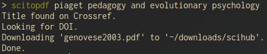

# scitopdf

`scitopdf` looks for articles from given titles on sci-hub, and downloads them in a destination folder (by default : `$HOME/downloads/scihub`). The interest of `scitopdf` is (1) it automatically locates sci-hub's website with http://sci-hub.now.sh/, (2) it is not as rigid on orthograph and syntax as sci-hub's search, (3) it downloads automatically the articles.

If you have a list of articles (say you pasted a bibliography in a .txt file), `scitopdf` can process each line and download each reference with the option `-l` (or `--list`). For example : `scitopdf --list list_of_articles.txt`.

## Getting Started

### Installing

To try `scitopdf`, you can clone this repository. For instance :

```
cd ~
git clone https://github.com/dougy147/scitopdf
```

Then, open your terminal and go to the folder you just cloned :

```
cd ~/scitopdf
```

And launch it like this :

```
sh scitopdf "title of the article you are looking for"
```

or directly with

```
sh scitopdf title of the article you are looking for
```

# Examples

Here's the result of `scitopdf` with a (free and open access) article.



