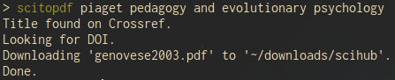

# scitopdf

`scitopdf` search for articles from a given title (not too rigid on orthograph) on sci-hub, and it downloads them in a `$HOME/downloads/scihub` folder. The interest of `scitopdf` is that it locates automatically sci-hub website thanks to http://whereisscihub.now.sh/ .

## Getting Started

### Prerequisites

`scitopdf` should work out of the box.

### Installing

To try `scitopdf`, you can clone this repository. For instance :

```
cd ~
git clone https://github.com/dougy147/scitopdf
```

Then, open your terminal and go to the folder you just cloned :

```
cd ~/scitopdf
```

And launch it like this :

```
sh scitopdf "title of the article you are looking for"
```

or directly with

```
sh scitopdf title of the article you are looking for
```

# Examples

Here's the result on `scitopdf` with a (free and open access) article.



